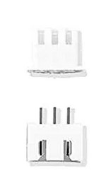
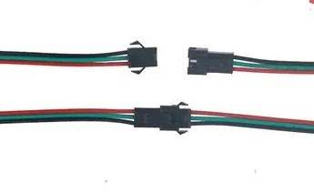
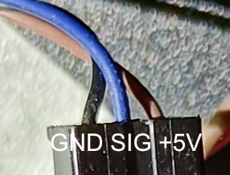
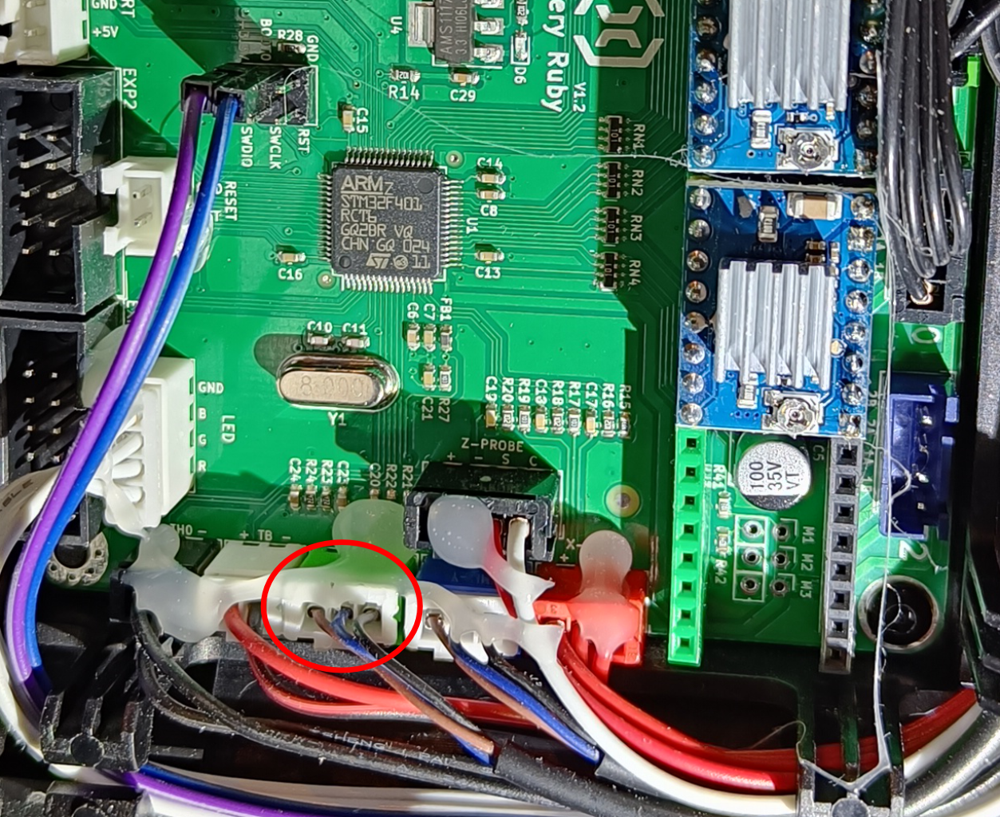
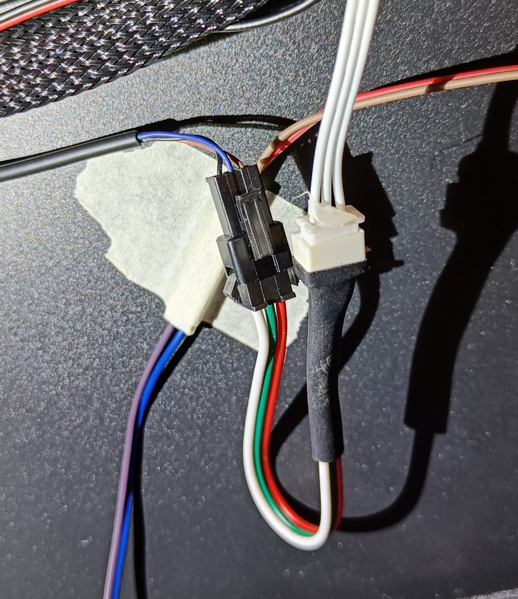

## Short Version

- Connect your filament runout-sensor to the z-endstop pins
- Configure a Klipper3D filament switch sensor section with the z-endstop pin (PA0)

## Long Version

The stock filament runout-sensor is connected to the TFT Display controller board. This is the reason why neither the Marlin firmware nor Klipper recognized it by default. For both firmware you have to connect the sensor to the Artillery Ruby mainboard instead of the TFT controller board.

There are some minor problems to solve:

1. Different voltage (3.3V vs 5V)
1. Connect wires to free usable pins
1. Configure Klipper

### Different voltage

The pins of the artillery ruby mainboard have either 5V or 24V. But the filament runout-sensor is connected to the TFT controller at a 3.3V pin.

Sadly no specs about the runout-sensor are in circulation. So nobody knows, if 5V would be to much for it. But after some investigation, all similar sensors have a voltage range of 3~5V. So I tried it and it worked. But of course it's your own decision and risk.

### Connect wires

#### Caution

**Do it only if you feel experienced enough. Be aware that you do it at your own risk and that you will probably lose the Artillery's warranty. I am not responsible for damages of any kind.**

I see two possibilities how to connect the filament-runout sensor wires to the correct pins. The fast version is without open the printer case. A beautiful solution is on the other hand to open the printer case.

#### The fast and dirty option

Build yourself a adapter from a male JST-XH 2.54mm connector with 3 pins to your z-endstop JST SM connector with 3 pins. The z-endstop plug is fixed on the right side by an adhesive tape.

You need the two connector types:

JST XH 2.54 connector | JST SM connector
-|-
 | 

Or you solve it just with some jumper cables. The pins from the filament runout sensors are 

If your filament runout sensor state LED is lit, your connection should be fine.

#### The beautiful option

The more beautiful option is to do nothing on the outside of your Sidewinder X2. Instead open your printer case at the bottom. (As with any other modification, know what you are doing and be aware that your warranty will be lost).

There is the original cable coming from the small z-axis board and goes to the TFT-Controller board. You have to unplug it from the TFT-Controller board and plug it into the z-endstop connector of your Artillery Ruby board.  Fix it with hot glue.

There is still one problem. The original cable was in my case not long enough. So I had to extend it. I did it by using my adapter cable from the fast and dirty version above.
 Instead, it would be better to replace the original cable with a cable that is long enough.

Finally it's time to configure Klipper.

### Configure Klipper

At the end you have to configure Klipper to use the newly connected filament-runout sensor. Thats probably the easiest part. 

Open your printer.cfg and add the following section

```yml
[filament_switch_sensor filament]
pause_on_runout: True # Starts the PAUSE g-code script if filament runs out
runout_gcode: M117 Filament runout # Optional
insert_gcode: M117 Filament insert # Optional
switch_pin: PA0 # the z-endstop pin
```

and restart the Klipper firmware afterwards.

If you did it right, you will see a new entry in your *Miscellaneous* Section in your Mainsail Web-UI.  It will toggle if you insert/remove filament into your filament-runout sensor. Also, your status lit will switch red/green as before.

## Conclusion

By walk through this post, you not only reenabled your filament-runout sensor - you also enabled it the first time for real. Even if you are still using the Marlin firmware, you have the first time the possibility to configure it in your firmware. I still don't know, why Artillery didn't connect it just right out of the box. But now it works and maybe you had some fun to fix the sensors.

Please leave comments, if something is wrong or missing. Or if you have questions.

And stay tuned, next post will be about Input Shaping and the ADXL345 acceleration sensor.

If you like, buy me a coffee [](https://ko-fi.com/F2F7GC8PC)

freakyDude
