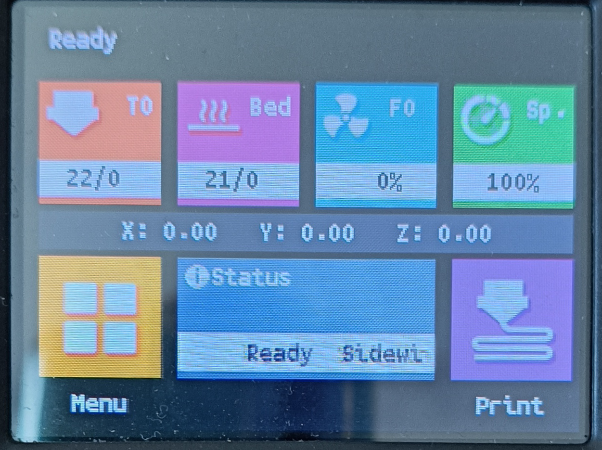
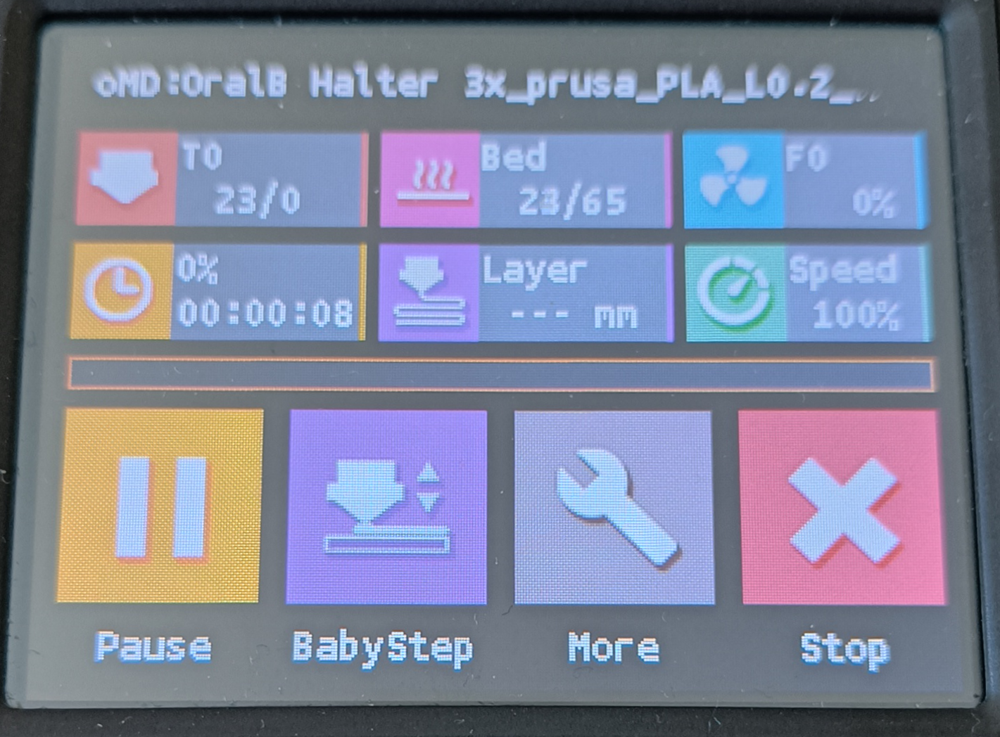
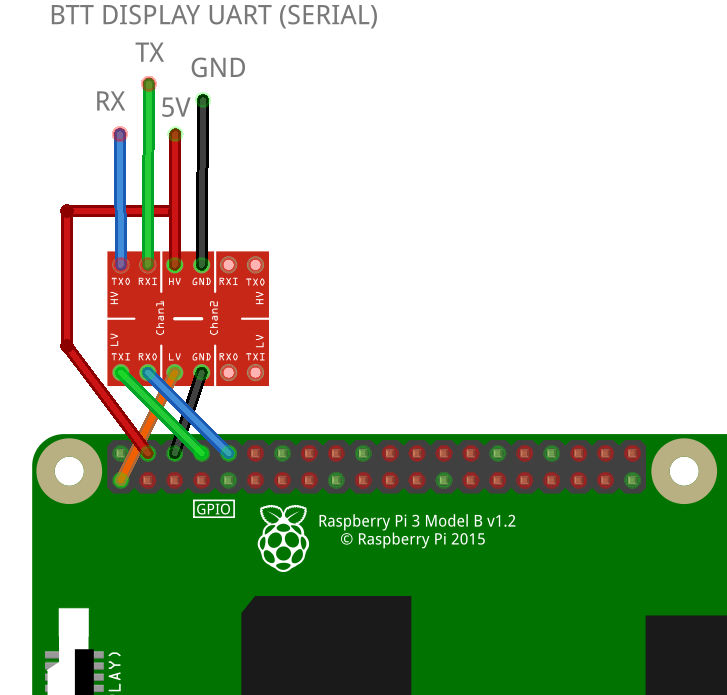

## Intro

If you have been following my recent posts, you know that I switched from Marlin to Klipper firmware on my Artillery Sidewinder X2. If you have done the same, you may be experiencing the same problem as me. I have already received questions from you about how much better the printing results are with Klipper, but that is another topic.

**Our integrated display is useless!**

But I found a solution - well - not perfect yet, but more than OK for my main use cases. After reading a lot of discussions I understood the relationships between the printer mainboard, the included TFT, Marlin and Klipper and got an idea.

So I started an experiment which I think was successful. It resulted in an open source project, which in itself is an experiment.

Sooo what am I talking about?!
I made the integrated display (and potentially any [supported BigTreeTech TFT](https://github.com/bigtreetech/BIGTREETECH-TouchScreenFirmware)) work with Klipper.

  

## Caution

First of all, and as always with my other posts and projects. I am not a company. I'm doing this in my spare time and mostly because I'm really excited to make these things work and improve things.

I tested all this stuff only with my own printer and the constellation around it. I did my best to make it all work without problems. However **There is no warranty. Be careful, watch your printer, double check things. Use it as it is. I assume no liability for damages or consequences of any kind.**

## Prerequisites

- A Raspberry PI or Bigtreetech CB1 (as mostly already in use for Klipper)
- A Level Shifter (cheap part, [for example](https://www.amazon.de/s?k=levelshifter+3%2C3+zu+5v&sprefix=levelshifter+%2Caps%2C83&ref=nb_sb_ss_ts-doa-p_1_13))
- A BTT TFT im TouchScreen Mode (I used it with Artillery Sidewinder X2, BTT TFT28 with GD32F305 chipset)
  - Most things should work with official artillery firmware
  - To get all the features, flash their open source [TouchScreenFirmware](https://github.com/bigtreetech/BIGTREETECH-TouchScreenFirmware#installation)
  - Not merged yet, but there is a version for your GD32F305 TFT controller version. See [this issue](https://github.com/bigtreetech/BIGTREETECH-TouchScreenFirmware/issues/2391) until it's mainline. Thanks for all the work guys!!

So, let's start hacking and improving your printer.

## Wiring

First, you need to wire things up. Disconnect the display from your mainboard. It needs to be connected to your Raspberry Pi instead.

I made a little schematic where you connect your PI with a level shifter to the UART (serial) interface of your BTT TFT (or compatible like the one in our Artillery Sidewinder X2).
It's really important to use a level shifter here. If your UART pins get 5V from your PI, they will be irreparably damaged, burned. **Be careful!**

That's not a mistake. Make sure that somewhere between the display UART and the RPi UART you have a TX (transmit) and RX (receive) crossover to allow a bidirectional connection between them.

That is all the hardware magic you need.

Now for the more interesting part, the software

## Software

The hardware wiring is only part of the story. The following schematic shows the relevant components, their connection and the type of data transferred. I hope it helps to understand the concept and the connections.

You can find my project at [https://github.com/freakydude/klipper-serial-btt](https://github.com/freakydude/klipper-serial-btt)

### Set up Serial software bridge with systemd service

Start preparing your RaspberryPi or BigTreeTech CB1 (or similar) as [described here](https://github.com/freakydude/klipper-serial-btt#prepare-your-raspberry-pi--btt-cb1)

### Set up Klipper (with Mainsail)

As you can see in the schematic above, your touchscreen and the BigTreeTech firmware running on it are based on g-codes. So basically it sends and receives Marlin compatible g-codes upon interaction.Therefore, in order for Klipper to communicate with the display in a useful way, we need to provide the necessary gcode macros for Klipper.

Start preparing your Klipper/Mainsail configs as [described here](https://github.com/freakydude/klipper-serial-btt#prepare-klippermainsail)

To keep the overview, I have split the macros into 4 files (at the time of writing).

#### fd-macros-example.cfg

For full Mainsail feature support, it is a must to add some macros. They even have a self-updating repository of what you can add to your Klipper/Mainsail configuration. To enable some functions on your TFT, some of these functions need to be changed. But, due to technical limitations, I don't know a way how to override gcode commands twice (that's what we would have to do).

This fact has consequences:

- At the moment I don't know a way to extend/replace their macros, but I need to. So I reimplemented the needed functionality. This makes me kind of sad. It also means you can't use their config files/project, they conflict with my scripts.
- I made this file, if you look at it, it mostly just calls "internal" macros, starting with `_FD_`. So I'm trying to give you the ability to "override" my individual scripts with whatever you want and hopefully not get into conflicts.

So if you have an Artillery Sidewinder X2 and just want to get started, use this file as it is and feel freakyDude's printing style ;-).

If you need or want to have your own scripts, don't include this file. But copy it completely, include your copy, still call the internal functions and adapt it to your needs. Its kind of a front for the other macros.

#### fd-macros/klipper-modules.cfg

This file activates all the modules needed to support all the features required by both Mainsail and BTT TouchScreen. If you have already configured some of the modules, you can delete them from your other config files.

#### fd-macros/mainsail-support.cfg

This file contains all the "internal" macros to support the current Mainsail features required by both Mainsail and BTT Touchscreen. I would not suggest replacing them. Use them as they are.

If there are problems with it, let's discuss the issue and create a pull request.

#### fd-macros/bigtreetech-support.cfg

Similar to `mainsail-support.cfg` this file contains all the "internal" macros to support the current BTT touchscreen features. Mostly this is a subset of the Marlin g-codes. It also sends some information to the display. I only implemented what I needed and tested the features. Some things don't fit between Klipper and Marlin. I think it's a good start. So it communicates in both directions.

As with the script above, use them as they are. If there are problems with it, let's discuss the issue and create a pull request.

### Set up your slicer

To enable the progress and color change features, configure your slicer as [described here](https://github.com/freakydude/klipper-serial-btt#prepare-your-slicer)

## Conclusion

If you have successfully followed my instructions, you may be one of the first people on the planet to have this combination, a BTT touchscreen in Marlin Touchscreen mode, working on a Klipper firmware-driven printer. And yes, since we are all green these days, you did not throw away your working hardware. Congratulations!

For further steps and more details it is always a good idea to go through the very good official documentation.

- [klipper-serial-btt (this project)](https://github.com/freakydude/klipper-serial-btt/tree/main)
- [Klipper Documentation](https://www.klipper3d.org/Overview.html)
- [Mainsail Documentation](https://docs.mainsail.xyz/)
- [BIGTREETECH-TouchScreenFirmware](https://github.com/bigtreetech/BIGTREETECH-TouchScreenFirmware)

Please leave a comment if something is wrong or missing. Or if you have any questions.

Have fun!

If you like, buy me a coffee

freakyDude
